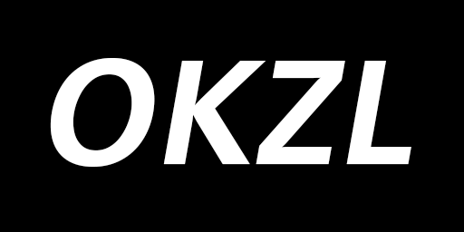

# OKZL - Open KevinZonda License

## LICENSE Collection List

- [OKZLF - Open KevinZonda License Framework](OKZLF.md)
  - OKZML - Open KevinZonda Main License
    - For repositories & projects
      - [OKZPL - Open KevinZonda Programme License](./okzml/okzpl/) derived from [MIT License](https://opensource.org/licenses/MIT)
    - For documents
      - [OKZDL - Open KevinZonda Document License](./okzml/okzdl/)
    - For information
      - [OKZIL - Open KevinZonda Information License](./okzml/okzil/) derived from [Open Government License v3.0](https://www.nationalarchives.gov.uk/doc/open-government-licence/version/3/)
  - OKZSL - Open KevinZonda Sub License
    - [NO-CSDN - Open KevinZonda No CSDN License](./okzsl/no-csdn/)